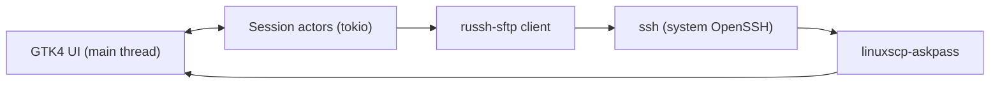

<div align="center">


# LinuxSCP

**A commander-style SFTP client for GNOME — a WinSCP for Linux.**

Free and open source. Built for people switching from Windows to Linux.

</div>

---

LinuxSCP is a native GTK4 / libadwaita SFTP client with a dual-pane, keyboard-driven
"commander" layout. It works **directly with your `~/.ssh/config`** — the same aliases,
jump hosts, keys, and agents you already use on the command line — because it drives the
system OpenSSH binary under the hood. It also handles **`sudo` / `su -` elevation** so you
can manage root-owned files, and every transfer is **resumable**.

## Features

- **Dual-pane commander UI** — local on one side, remote on the other, `Tab` to switch,
  and a `..` row at the top of each pane to go up a directory.
- **Tabbed sessions** — open as many connections as you like, WinSCP-style: each tab is a
  full dual-pane session, and the "New Session" button next to the tabs spawns the next one.
- **Site manager with folders** — organize saved connections in a nested folder tree
  (WinSCP-style), created and edited entirely in-app: `~/.ssh/config` hosts on the left,
  saved sites in the middle, and the selected site's details edited inline on the right,
  with a new site appearing in the list as you type its name. A search box filters the
  folder tree, the saved sites, and the `~/.ssh/config` hosts together; sites and whole
  folders can be dragged between folders. Set the username, override the port, choose
  password or PEM-key authentication, pick the elevation mode and a landing directory per
  site. Passwords and key passphrases are stored in the OS keyring (Secret Service /
  gnome-keyring), never in plain text.
- **Zero-config connections too** — still reads `~/.ssh/config` (aliases, `ProxyJump`,
  `ControlMaster`, `IdentityFile`, agent and FIDO/hardware keys) by using your real `ssh` —
  and the config file itself can be edited right inside the site manager.
- **Root file management** — connect and elevate with `sudo` or `su -`, WinSCP-style, without
  changing anything in `sshd_config`.
- **Robust transfers** — a queue with live progress, speed and ETA; pause, resume and cancel;
  recursive directory copies; conflict prompts (overwrite / resume / skip). Scanning and
  copying run in parallel and several files are in flight at once, so large trees start
  transferring immediately and folders full of small files aren't bottlenecked by
  per-file round trips.
- **Resume across disconnects** — interrupted files are staged as `.filepart` and continued
  from their offset on the next try.
- **Full file management** — create folders, rename, delete (recursive), new symlinks, and
  a right-click context menu with clipboard copy / cut / paste ("Copy to…" and "Move to…"
  included). A WinSCP-style Properties dialog shows size and disk usage and edits
  permissions, owner and group — recursively when asked. Remote owners are shown by name,
  and drag and drop works between panes.
- **Transfer notifications** — when a transfer finishes, LinuxSCP plays a success chime and
  posts a GNOME desktop notification. Both are independently toggleable in Preferences.
- **Quality of life** — splash screen, "open terminal here" (local shell or `ssh` into the
  host), reconnect on drop, and remembered preferences.

## Authentication and saved sites

Open the **Site Manager** (the server button in either pane's header, or automatically at
launch). From there you can:

- Build a folder tree and drop sites into it; folders nest arbitrarily, and both sites
  and whole folders can be **dragged** to reorganize (the Delete key removes whatever is
  selected).
- Create a site with an explicit **host, port, and username** — it appears in the site
  list immediately and is edited in the details panel on the right, WinSCP-style.
- **Search** across everything at once: saved sites, folders, and `~/.ssh/config` hosts.
- **Edit `~/.ssh/config`** in-app; the host list reloads on save.
- Choose how to authenticate:
  - **SSH agent / default keys** — defer to your agent and `~/.ssh/config` (the default).
  - **Password** — typed each time, or saved to the keyring and auto-filled.
  - **Key file (PEM)** — pick a private key; an optional passphrase can be saved too.
- Set a per-site **elevation** mode (`sudo` / `su -`) and a **remote directory** to open in.

Secrets live in the OS keyring keyed by an opaque site id; `settings.json` only records
whether a secret exists, never its value.

## Keyboard shortcuts

| Key | Action | Key | Action |
| --- | --- | --- | --- |
| `Tab` | Switch active pane | `F5` | Copy to other pane |
| `Enter` | Open directory | `F6` | Move to other pane |
| `Backspace` | Parent directory | `F7` | New directory |
| `F2` | Rename | `F8` / `Del` | Delete |
| `F9` | Properties (permissions, owner, group) | `Ctrl+H` | Toggle hidden files |
| `Ctrl+C` / `Ctrl+X` | Copy / cut selection | `Ctrl+V` | Paste |
| `Ctrl+R` | Refresh | `Ctrl+L` | Edit path |
| `Ctrl+T` | Open terminal here | Right click | Context menu |

## How it works

LinuxSCP does not reimplement SSH. Instead it spawns your system `ssh` and speaks the SFTP
protocol over its pipes:

- **Normal connections** run `ssh -s <host> sftp` — the SFTP subsystem, exactly like the
  `sftp` command.
- **Elevated connections** allocate a remote PTY, drive the `sudo`/`su` password prompt, put
  the PTY into raw mode, and then `exec sftp-server`. From that point the PTY carries the
  binary SFTP protocol as root.
- **Prompts** (passwords, key passphrases, host-key confirmations) are routed from OpenSSH
  back into GTK dialogs through a small `SSH_ASKPASS` helper and a private unix socket.



## Building from source

You need a Rust toolchain and the GTK4 / libadwaita development packages.

```bash
# Debian / Ubuntu
sudo apt install libgtk-4-dev libadwaita-1-dev build-essential

# Fedora
sudo dnf install gtk4-devel libadwaita-devel

# Arch
sudo pacman -S gtk4 libadwaita

# Then build and run
cargo run -p linuxscp
```

Install system-wide (binary, desktop file, icon, metainfo):

```bash
sudo make install
```

## Debian / Ubuntu package (.deb)

Prebuilt `.deb`s for **x86-64 and ARM64** are attached to every
[release](https://github.com/linuxscp/linuxscp/releases) (built on Ubuntu 24.04,
with SHA-256 checksums). They install on Debian 13 "Trixie", Ubuntu 24.04 LTS,
and newer — anything shipping GTK4 ≥ 4.12 and libadwaita ≥ 1.5. On older systems
`apt` will refuse cleanly; build from source instead.

```bash
sudo apt install ./linuxscp_amd64.deb   # or linuxscp_arm64.deb
```

Or build a `.deb` from a release build (no debhelper needed, just `dpkg-deb`):

```bash
make deb            # or: ./scripts/build-deb.sh
```

This produces `target/deb/linuxscp_<version>_<arch>.deb` with the binaries, the
desktop entry, AppStream metainfo, and the app icon rendered at every hicolor
size (16–512 px). Library dependencies are computed automatically with
`dpkg-shlibdeps`, and `openssh-client` is added since LinuxSCP drives the system
`ssh`. Install it with:

```bash
sudo apt install ./target/deb/linuxscp_*_amd64.deb   # resolves dependencies
# or
sudo dpkg -i ./target/deb/linuxscp_*_amd64.deb
```

The package's `postinst` refreshes the icon cache and desktop database, so the
penguin icon and "LinuxSCP" launcher show up in the app grid immediately.

## Flatpak

```bash
flatpak-builder --user --install build build-aux/io.github.linuxscp.LinuxSCP.json
```

The Flatpak reaches the host's `ssh`, keys and agent via the host portal, so your
`~/.ssh/config` continues to work inside the sandbox.

## Development & testing

Unit tests run anywhere. The end-to-end SFTP tests use a throwaway local sshd:

```bash
cargo test                                          # unit tests
./scripts/test-server.sh start                      # local sshd on 127.0.0.1:2299
cargo test -p linuxscp --test sftp_roundtrip -- --ignored
./scripts/test-server.sh stop
```

`scripts/test-server.sh run` starts the test server and launches the app pointed at it
(host alias `testbox`; the fake `su` password is `secret123`).

## License

GPL-3.0-or-later. See [LICENSE](LICENSE). Free for everyone, forever.
